# Core-Periphery Analysis: Reddit

## Funny - Reddit

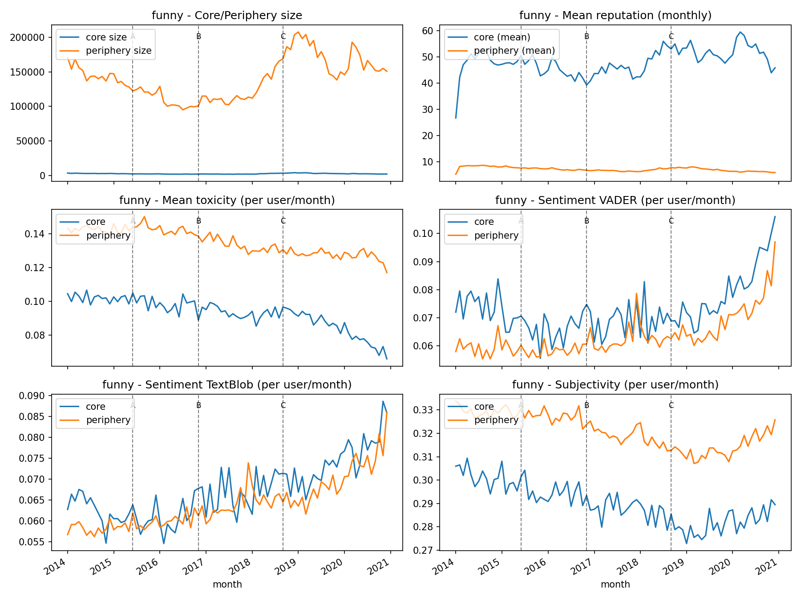{width=100%}

## Key Insights: Funny - Reddit

- **Stable core, dynamic periphery**: Core size remains flat (~5K users) while periphery surges from 100K to 200K at Event C, indicating Reddit retained established contributors but attracted massive new casual engagement
- **Core-periphery toxicity inversion**: Core users maintain lower toxicity (0.07-0.10) than periphery (0.12-0.15), with core declining post-2018—suggesting moderation or norm enforcement from established users
- **Sentiment convergence**: Both core and periphery sentiment trend upward and converge (0.07-0.09) by 2021, possibly reflecting community-wide cultural shift toward more positive engagement

## Gaming - Reddit

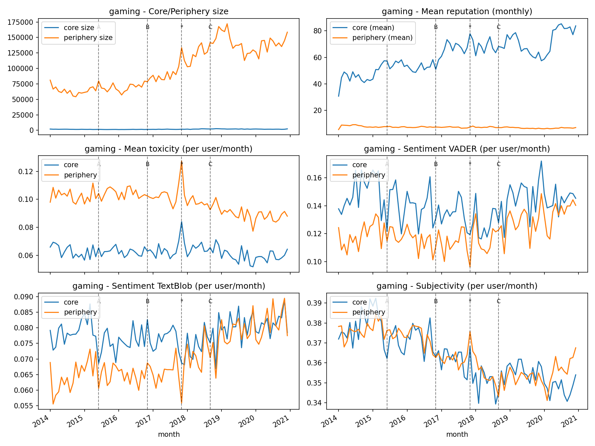{width=100%}

## Key Insights: Gaming - Reddit

- **Periphery explosion at Event C**: Periphery doubles from 75K to 175K at 2018 QAnon ban while core stays flat (~3K), suggesting Reddit gaming attracted mainstream users fleeing conspiracy-dominated spaces
- **Persistent core advantage**: Core maintains 40-80 reputation (6-8x periphery's ~10) and consistently lower toxicity (0.06 vs 0.10), demonstrating strong hierarchical structure with veteran gatekeepers
- **Sentiment parity with volatility**: Core and periphery show similar sentiment means (0.12-0.14) but core exhibits higher variance spikes, possibly reflecting passionate debates among established users

## Gifs - Reddit

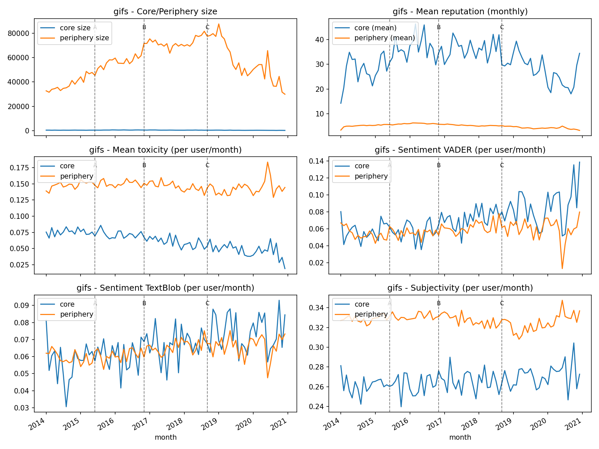{width=100%}

## Key Insights: Gifs - Reddit

- **Post-Event C collapse**: Periphery crashes from 85K peak to 30K by 2021 while core flatlines near zero, suggesting r/gifs lost relevance as video formats displaced static gifs platform-wide
- **Declining core toxicity advantage**: Core toxicity drops from 0.08 to 0.02 by 2021 (falling below periphery's stable 0.14), possibly indicating only the most civil veteran users remained engaged
- **Sentiment divergence at end**: Core sentiment surges to 0.14 in 2021 while periphery drops near zero, reflecting different user cohorts with core becoming small, positive-affect remnant

## Pics - Reddit

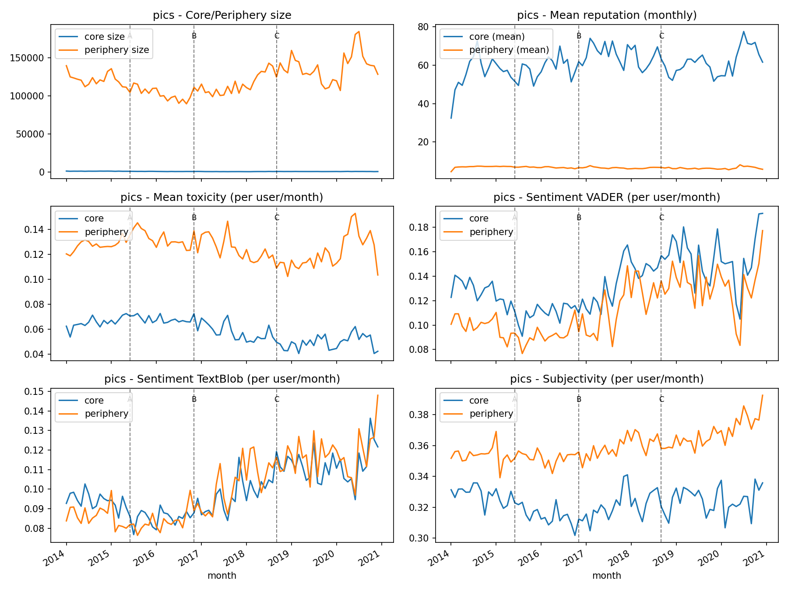{width=100%}

## Key Insights: Pics - Reddit

- **Volatile periphery, steady core**: Periphery fluctuates 100K-180K with spike at Event C while core stays flat (~3K), showing mainstream appeal with stable veteran contributor base
- **Shrinking toxicity gap**: Core maintains lower toxicity (0.04-0.07) than periphery (0.10-0.15) throughout, but gap narrows as both decline—suggesting platform-wide norm shifts
- **Sentiment convergence with role reversal**: Initially periphery more positive, but by 2018 core surpasses periphery (0.14-0.18 vs 0.10-0.15), indicating veteran users became more emotionally invested over time

## Technology - Reddit

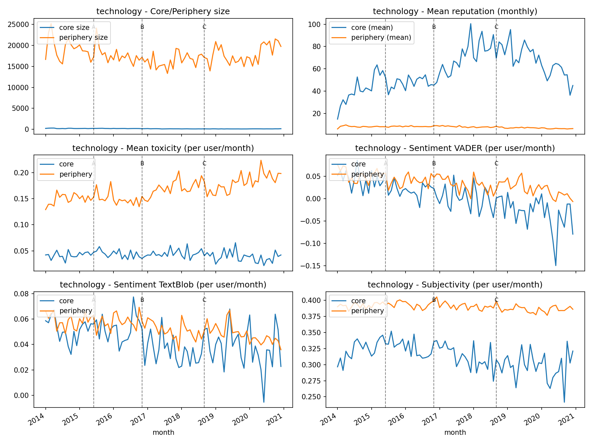{width=100%}

## Key Insights: Technology - Reddit

- **Exceptional core reputation growth**: Core reputation climbs from 20 to 100 by Event C (highest growth among all communities), suggesting r/technology successfully retained and elevated expert contributors through moderation crises
- **Extreme toxicity disparity**: Periphery toxicity (0.15-0.22) consistently 3-4x higher than core (0.03-0.05), indicating strong gatekeeping by technical experts against low-quality/inflammatory posts
- **Parallel sentiment decline**: Both core and periphery trend negative post-2017, converging around -0.05 to -0.10, reflecting broader tech industry disillusionment (privacy, monopolies, misinformation) independent of deplatforming events

## Videos - Reddit

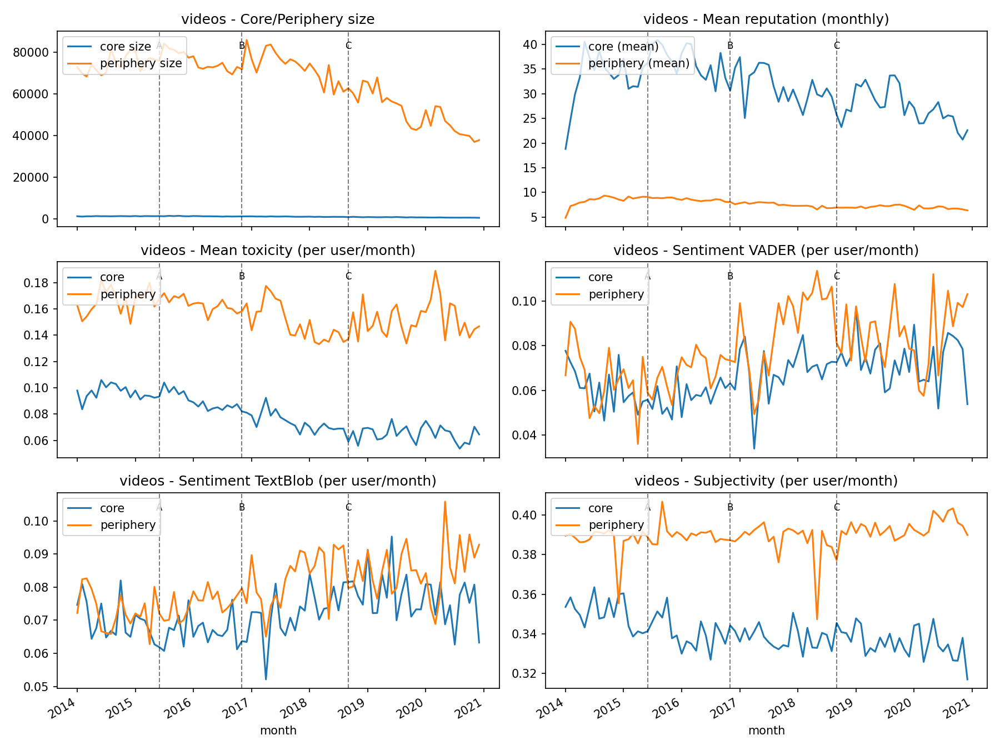{width=100%}

## Key Insights: Videos - Reddit

- **Steady decline across metrics**: Periphery shrinks from 80K to 40K (2014-2021) while core flatlines, with core reputation falling from 35 to 20—suggesting r/videos lost appeal as specialized video platforms (YouTube, TikTok) dominated
- **Persistent but declining toxicity gap**: Core maintains lower toxicity (0.06-0.10) than periphery (0.14-0.18), both declining over time as inflammatory content migrated to video platforms
- **Sentiment convergence**: Core and periphery converge around 0.07-0.09 by 2018, losing earlier distinction—indicates homogenization as engaged users left for other platforms

# Core-Periphery Analysis: Voat

## CringeAnarchy - Voat

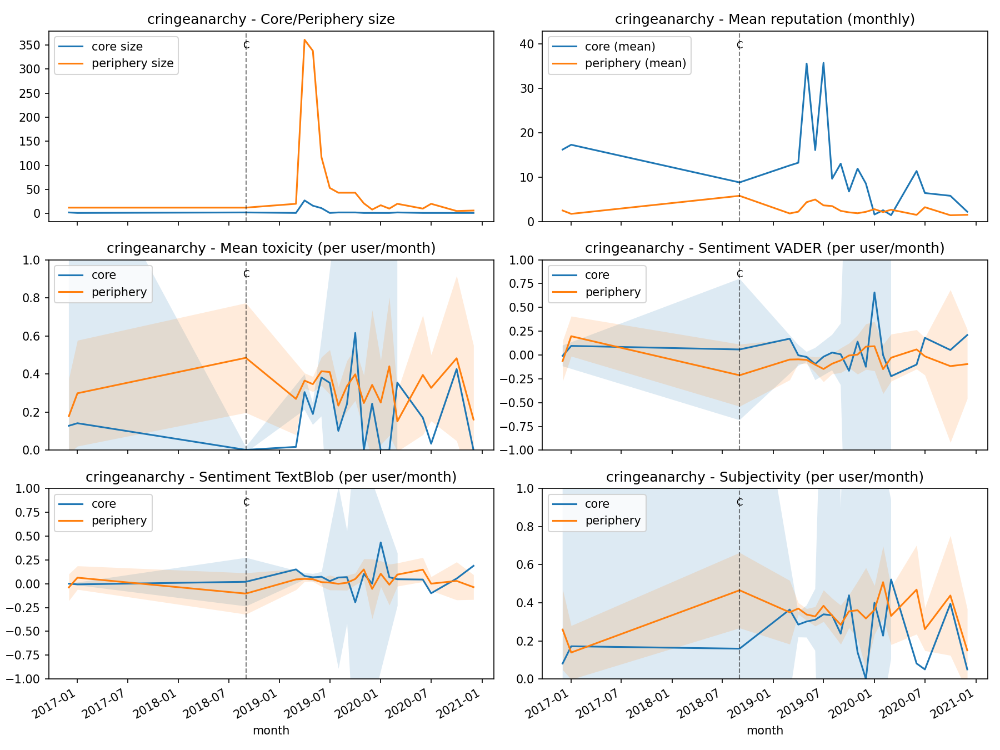{width=100%}

## Key Insights: CringeAnarchy - Voat

- **Event C migration spike and collapse**: Periphery explodes to 350 users at 2018 QAnon ban, then crashes to <50—CringeAnarchy migrants briefly activated this hate-focused subverse before abandoning it
- **Extreme toxicity oscillations**: Post-migration, toxicity fluctuates wildly (0.0-0.6 for core, 0.2-0.5 for periphery), with core spikes at 0.6—reflects small, volatile user base engaging in extreme content
- **Core reputation anomaly**: Core reputation spikes to 35 at Event C then crashes—suggests brief influx of higher-status migrants who quickly churned out, leaving low-reputation remnant

## FatPeopleHate - Voat

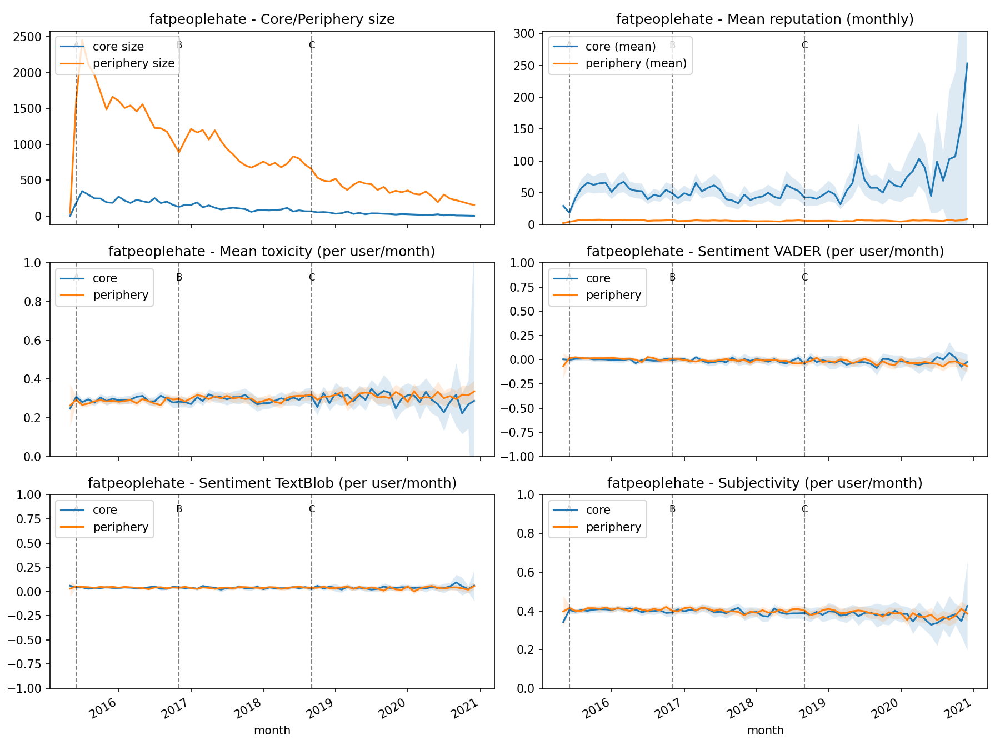{width=100%}

## Key Insights: FatPeopleHate - Voat

- **Sustained but declining activity**: Periphery starts at 2000 (largest Voat community post-Event A) and gradually declines to 200 by 2021, while core stabilizes at 300-400—original r/fatpeoplehate migrants maintained long-term presence
- **Consistently high toxicity**: Both core and periphery maintain 0.28-0.34 toxicity (3-4x typical Reddit levels) throughout entire timeline, with convergence—hate speech remained normalized community norm
- **Late reputation surge**: Core reputation spikes to 250 in 2021 (near platform shutdown), possibly reflecting measurement artifact or final concentration of die-hard users accumulating karma

## Funny - Voat

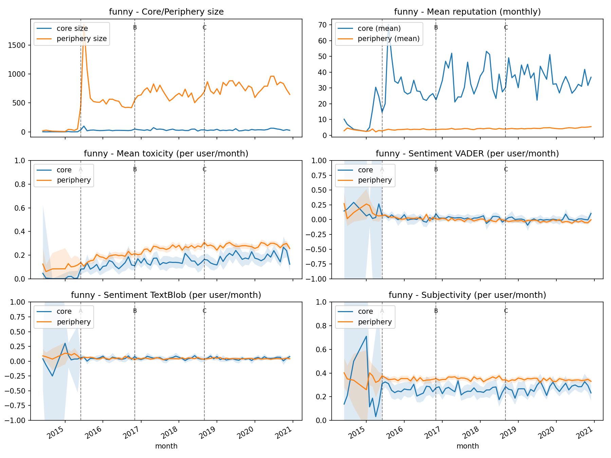{width=100%}

## Key Insights: Funny - Voat

- **Event A surge then stabilization**: Periphery spikes to 1500 at 2015 harassment ban, then stabilizes at 600-900—v/funny absorbed generalist r/fatpeoplehate migrants seeking entertainment but retained substantial base
- **Escalating toxicity divergence**: Periphery toxicity climbs from 0.12 to 0.30 (2015-2021) while core rises from 0.08 to 0.25—both groups radicalized over time as platform culture shifted
- **Sentiment collapse**: Both core and periphery drop from positive (0.05-0.20) to near-zero/negative by 2017, never recovering—entertainment content became increasingly cynical and hostile

## Gaming - Voat

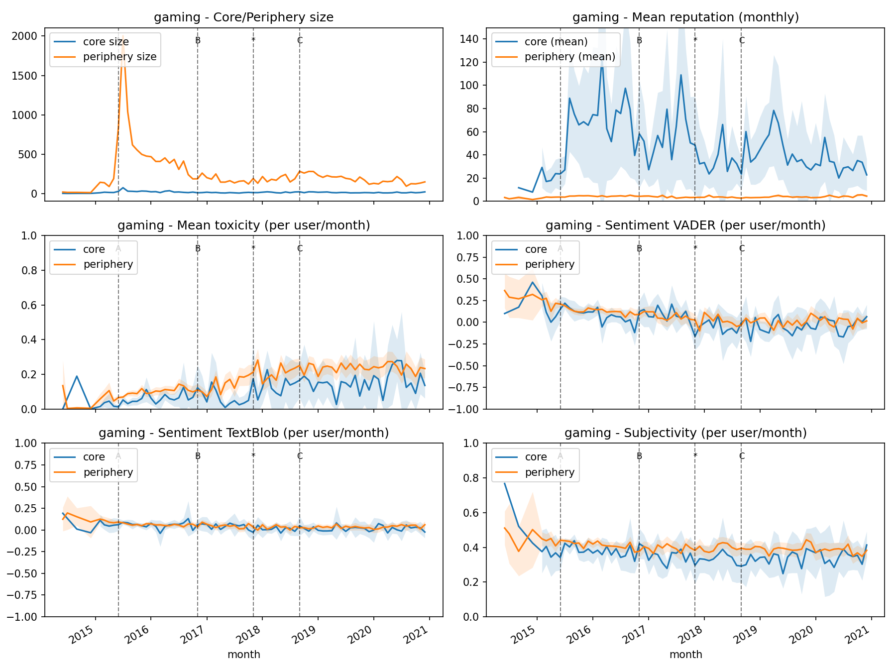{width=100%}

## Key Insights: Gaming - Voat

- **Boom-bust cycle at Event A**: Periphery surges to 1800 (2015 ban), crashes to 200, then flatlines at 100—initial r/fatpeoplehate migrants briefly tried v/gaming but abandoned it as conspiracy users dominated Voat
- **Core reputation volatility**: Core reputation oscillates wildly (20-110), peaking around Events B/C, then declining—small core couldn't stabilize as generalist migrants churned out
- **Converging negative sentiment**: Both groups trend from positive (0.20-0.30) in 2015 to near-zero/negative by 2020—gaming discussions became increasingly pessimistic as community fragmented

## Gifs - Voat

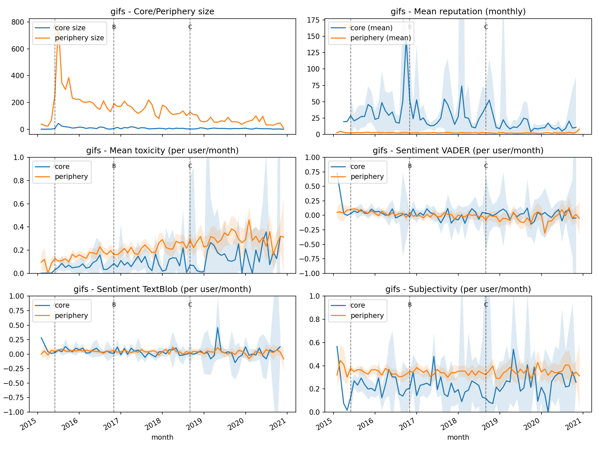{width=100%}

## Key Insights: Gifs - Voat

- **Event A spike then gradual decline**: Periphery peaks at 650 (2015), steadily declines to <100 by 2021—v/gifs couldn't sustain generalist migrants as static gifs lost relevance platform-wide
- **Late toxicity surge**: Periphery toxicity escalates from 0.15 to 0.45 after Event C (2018-2021), suggesting conspiracy-focused late arrivals dominated the dying community
- **Core reputation spike anomaly**: Core reputation jumps to 120-150 around Event B with high volatility—possibly measurement artifact from small sample size (~20-30 core users)

## GreatAwakening - Voat

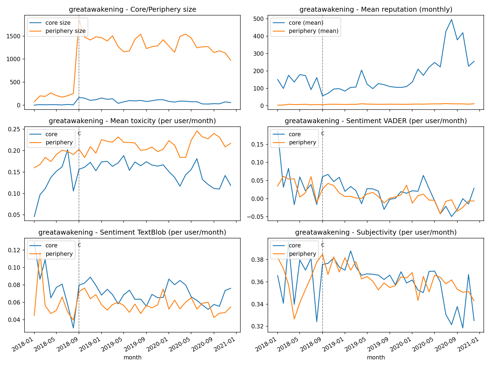{width=100%}

## Key Insights: GreatAwakening - Voat

- **Event C identity-driven migration**: Periphery surges to 1500+ at 2018 QAnon ban and sustains 1100-1500 through 2021—conspiracy narratives tied to user identity created exceptional retention (as predicted by RECRO framework)
- **Core reputation explosion**: Core reputation climbs from 100 to 500 by 2020 (highest across all Voat communities)—QAnon leaders accumulated massive influence within tightly-knit conspiratorial network
- **Moderate toxicity convergence**: Both groups maintain 0.15-0.25 toxicity (lower than hate communities)—conspiracy focus channeled engagement toward narrative-building rather than harassment

## KotakuInAction - Voat

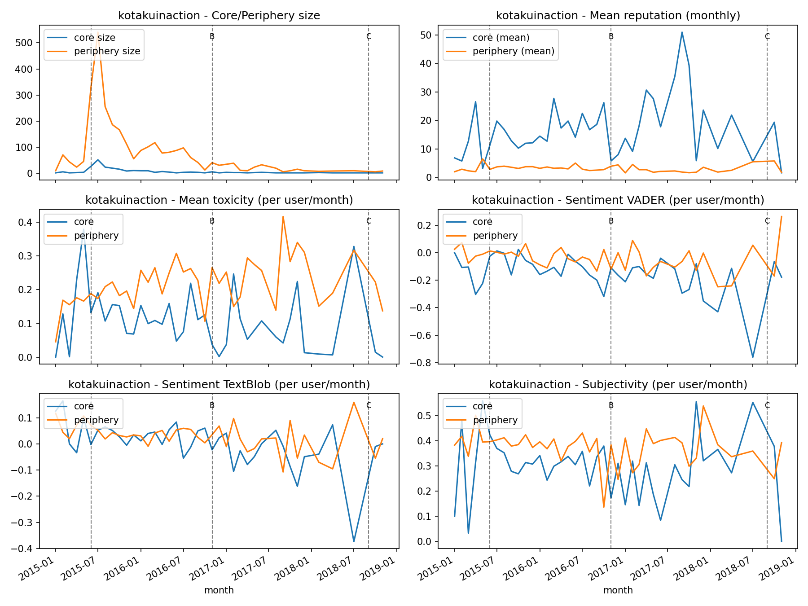{width=100%}

## Key Insights: KotakuInAction - Voat

- **Event A spike then rapid abandonment**: Periphery surges to 450 (2015), crashes to <50 by 2017—GamerGate-focused users didn't maintain long-term presence, likely staying primarily on Reddit
- **High toxicity with wild fluctuations**: Toxicity oscillates 0.10-0.40 with core spikes at 0.40+, reflecting small, volatile user base engaging in culture-war rhetoric
- **Deeply negative sentiment**: Core sentiment plummets to -0.6 to -0.8 by 2018 (lowest observed)—grievance-driven community became increasingly pessimistic before collapse

## MensRights - Voat

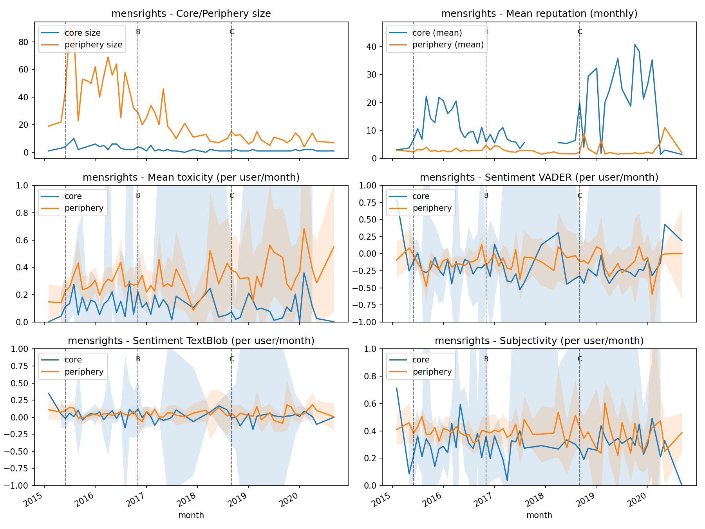{width=100%}

## Key Insights: MensRights - Voat

- **Event A spike then gradual decline**: Periphery peaks at 80 (2015), declines to <10 by 2020—MensRights migrants didn't establish lasting presence, possibly remaining on more moderate r/MensRights
- **Extreme periphery toxicity**: Periphery toxicity escalates to 0.40-0.70 (highest observed), far exceeding core's 0.10-0.30—small periphery became extremely radicalized
- **Core reputation spikes at Event C**: Core reputation jumps to 35-40 around 2018-2019 with high volatility—reflects small sample artifacts as community neared extinction

## MillionDollarExtreme - Voat

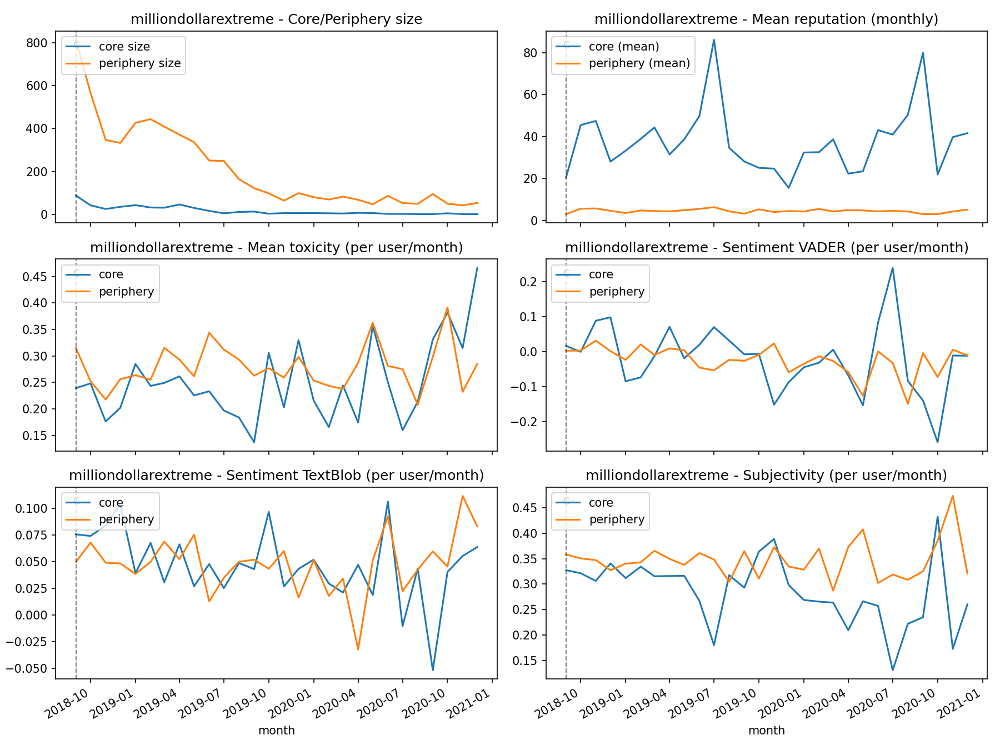{width=100%}

## Key Insights: MillionDollarExtreme - Voat

- **Post-2018 ban sustained activity**: Periphery starts at 650 after r/MillionDollarExtreme ban, gradually declines to 100—banned edgy comedy community maintained presence through platform shutdown
- **Consistently high toxicity**: Both core and periphery maintain 0.25-0.40 toxicity throughout timeline, converging at end—ironic/transgressive humor culture normalized extreme language
- **Core reputation volatility**: Core reputation oscillates 20-80 with dramatic spikes—small core (~50 users) showed unstable hierarchy, lacking established opinion leaders

## Pics - Voat

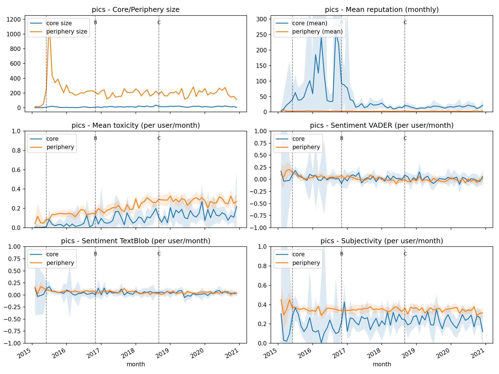{width=100%}

## Key Insights: Pics - Voat

- **Event A massive surge then stabilization**: Periphery spikes to 1000 (2015), stabilizes at 200-300—v/pics attracted substantial r/fatpeoplehate migrants seeking generalist content alongside v/funny
- **Escalating periphery toxicity**: Periphery toxicity climbs from 0.10 to 0.30 (2015-2021), while core rises from 0.05 to 0.20—both radicalized but periphery consistently worse
- **Core reputation spikes then collapse**: Core reputation surges to 180-220 around 2016-2017, crashes to <20 by 2019—early high-status migrants abandoned community as culture deteriorated

## Technology - Voat

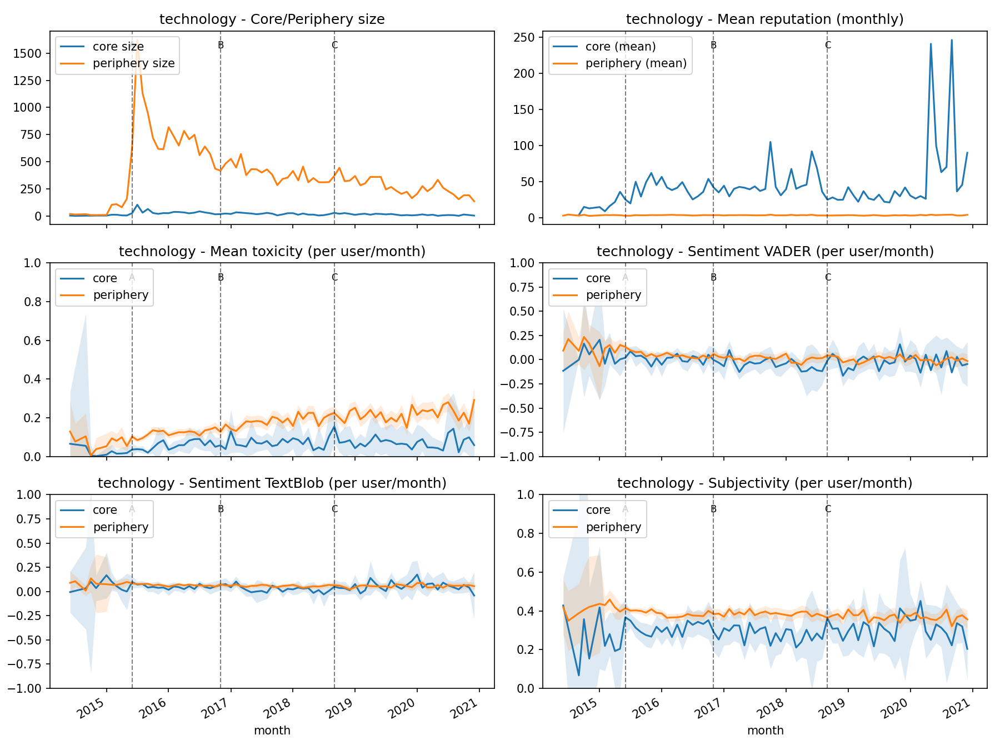{width=100%}

## Key Insights: Technology - Voat

- **Event A surge with sustained base**: Periphery peaks at 1300 (2015), stabilizes at 300-400—v/technology retained significant generalist migrants interested in privacy/censorship discussions aligned with Voat's ethos
- **Escalating periphery toxicity**: Periphery toxicity climbs from 0.10 to 0.25 (2015-2021) while core stays lower (0.05-0.10)—tech discussions increasingly politicized
- **Late core reputation surge**: Core reputation jumps to 250 in 2020-2021 (near shutdown), mirroring Reddit pattern—possible artifact or final concentration of veteran users

## Videos - Voat

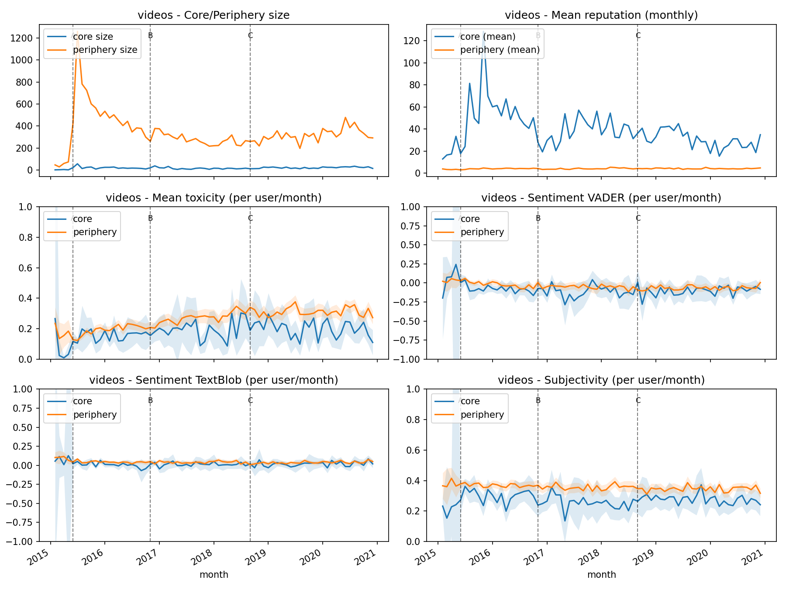{width=100%}

## Key Insights: Videos - Voat

- **Event A surge with moderate retention**: Periphery peaks at 1000 (2015), stabilizes at 300-400—v/videos retained generalist migrants similarly to v/funny and v/pics as major entertainment hub
- **Converging high toxicity**: Core and periphery converge at 0.25-0.35 toxicity by 2019-2021—video discussions became uniformly radicalized as platform culture homogenized
- **Core reputation decline**: Core reputation drops from 100 to 20 (2015-2021)—early high-status users left, remaining core lost influence as community fragmented

# Core Time Series Analysis
## Funny Community

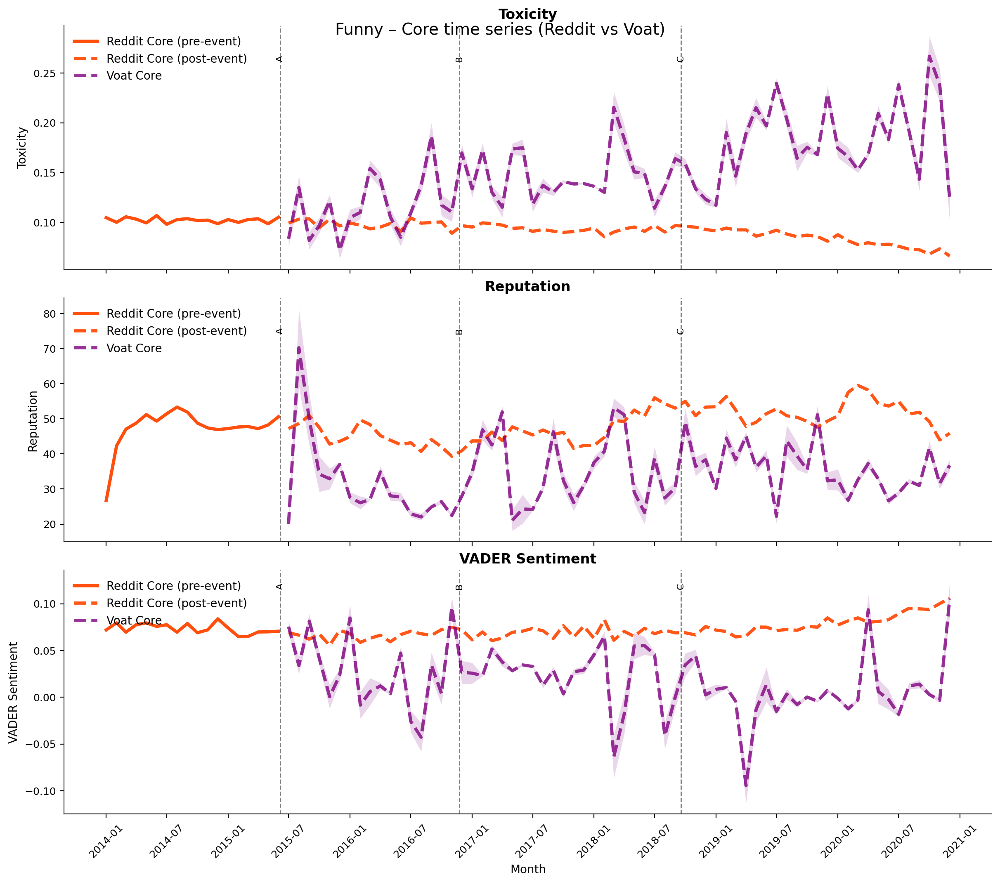{width=100%}

## Key Insights: Funny Community

- **Platform divergence post-ban**: Event A (2015 harassment policy) marks sharp separation—Voat Core toxicity doubles to 0.15-0.25 while Reddit Core remains stable at ~0.10
- **Migration wave effects**: Reputation spike at Event A reflects influx of generalist migrants (e.g., r/fatpeoplehate users), followed by decline as later conspiracy-focused waves (Events B, C) brought more volatile, lower-reputation users
- **Sentiment polarization**: Reddit Core sustains positive affect (0.05-0.10); Voat Core oscillates near neutral/negative, reflecting concentration of displaced users with antisocial norms

## Gaming Community

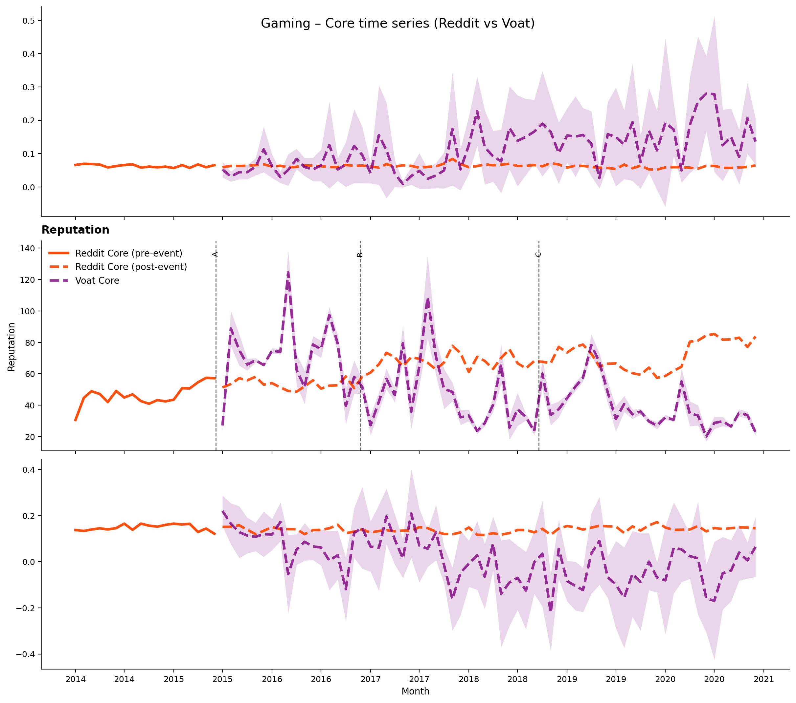{width=100%}

## Key Insights: Gaming Community

- **Catastrophic reputation collapse**: Voat Core reputation spikes to 120+ at Event A (r/fatpeoplehate migrants joining generalist subverses), then crashes to 20-30 by Event C as conspiracy-focused waves starved /v/gaming of new connectors
- **Extreme toxicity volatility**: Voat Core toxicity fluctuates wildly (0.0-0.5 range with massive variance), contrasting with Reddit's flat ~0.05-0.07 stability—reflecting high turnover and loss of cohesive core
- **Sentiment erosion**: Voat Core sentiment trends increasingly negative post-Event B, hovering near -0.2 by 2020, while Reddit Core maintains stable positive affect (~0.12-0.15)

## Gifs Community

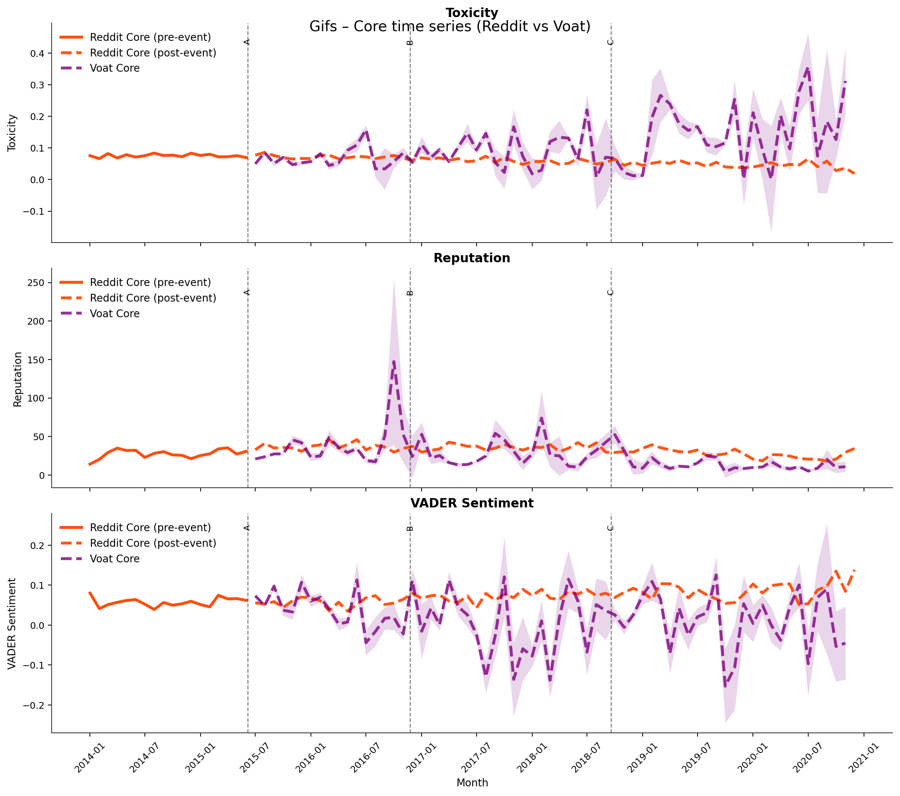{width=100%}

## Key Insights: Gifs Community

- **Delayed toxicity escalation**: Voat Core toxicity remains modest (0.05-0.15) until Event C (2018 QAnon ban), then surges to 0.25-0.40 by 2019—suggesting late-arriving conspiracy users colonized this generalist space
- **Converging low reputation**: Both platforms show declining reputation trends, converging around 20-30 by 2020, indicating /v/gifs failed to retain high-reputation generalist migrants from Event A
- **Persistent negative sentiment**: Voat Core sentiment drops sharply below zero after Event B and remains consistently negative (-0.05 to -0.15), while Reddit Core maintains positive affect (0.07-0.12)

## Pics Community

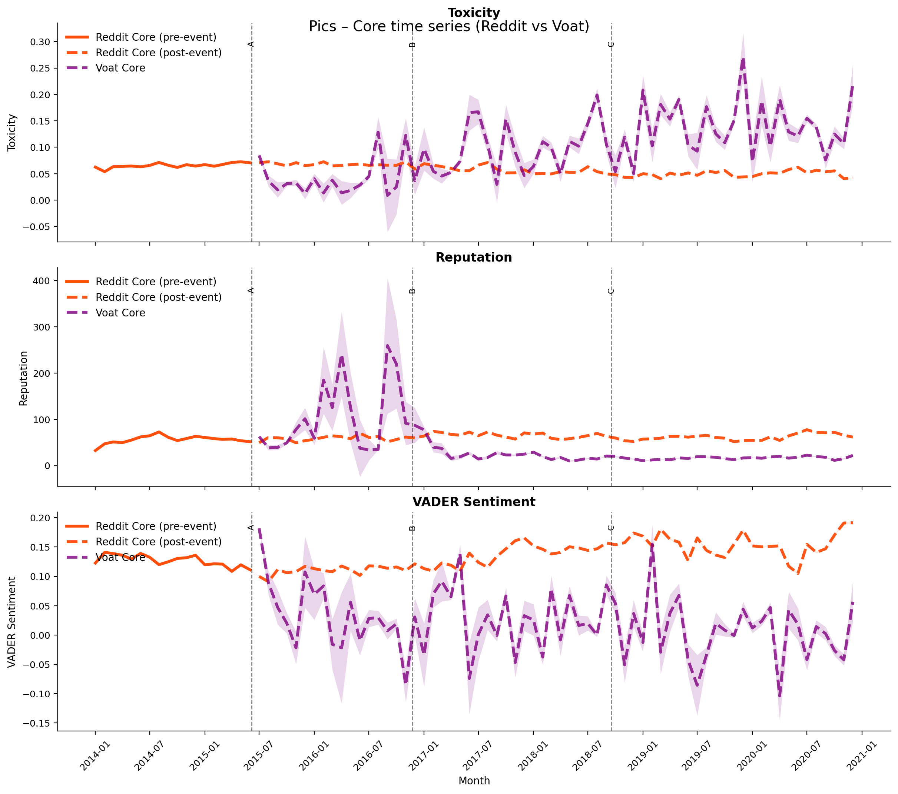{width=100%}

## Key Insights: Pics Community

- **Massive reputation spike then total collapse**: Voat Core reputation explodes to 250+ around Event A/B (highest among all generalist communities), then crashes to <25 and flatlines—indicating initial high-status migrants abandoned the community
- **Gradual toxicity creep**: Voat Core toxicity starts low (~0.02) but steadily escalates to 0.15-0.25 by 2019, tripling Reddit's stable ~0.05 baseline as the community composition shifted
- **Sentiment floor effect**: Voat Core sentiment oscillates around zero with frequent dips to -0.10, never sustaining the positive affect (0.10-0.20) Reddit Core maintains throughout

## Technology Community

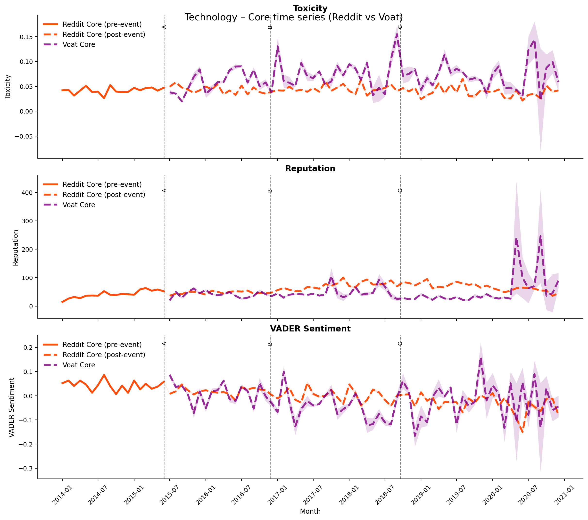{width=100%}

## Key Insights: Technology Community

- **Toxicity convergence**: Both platforms show similar modest toxicity (~0.04-0.05), with Voat only slightly elevated (0.05-0.10)—technology discussions appear more resistant to radicalization than entertainment communities
- **Late reputation anomaly**: Voat Core reputation remains flat (20-40) until a dramatic 250+ spike in late 2020, suggesting either measurement artifact or brief influx of high-status users near platform shutdown
- **Parallel sentiment decline**: Both Reddit and Voat cores trend increasingly negative after 2018, converging around -0.10 by 2020—possibly reflecting broader tech discourse polarization independent of platform

## Videos Community

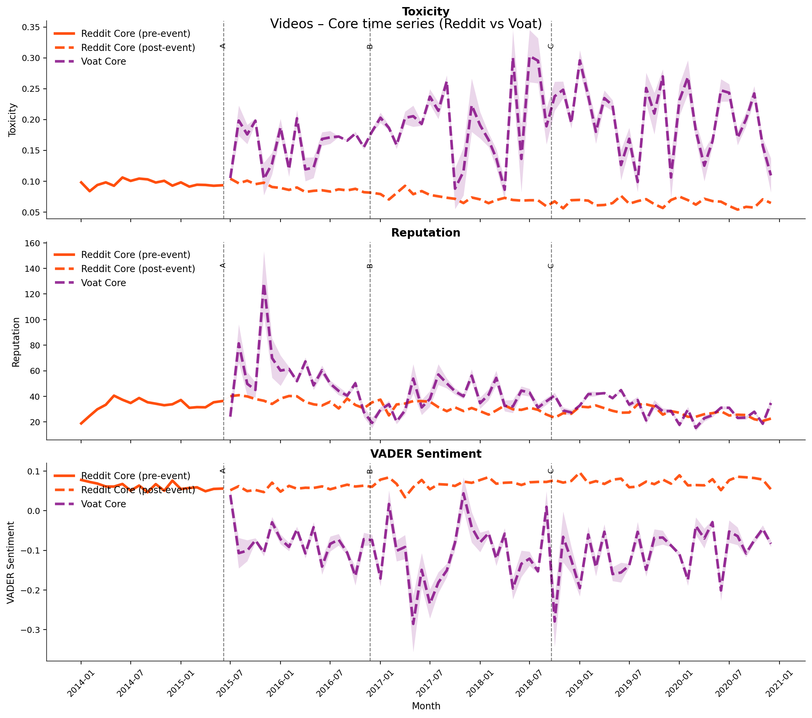{width=100%}

## Key Insights: Videos Community

- **Immediate and sustained toxicity gap**: Voat Core toxicity jumps to 0.15-0.20 at Event A and escalates to 0.20-0.30 range, 3-4x Reddit's stable ~0.07—videos became a toxic content haven from the start
- **Early reputation peak then steady decline**: Voat Core reputation spikes to 125+ at Event A, then gradually decays to converge with Reddit (~20-30) by 2020, suggesting initial high-reputation migrants left or disengaged
- **Deep negative sentiment**: Voat Core maintains consistently negative affect (-0.10 to -0.25) across entire timeline, while Reddit Core sustains positive sentiment (0.05-0.10)—starkest affective divide among generalist communities

